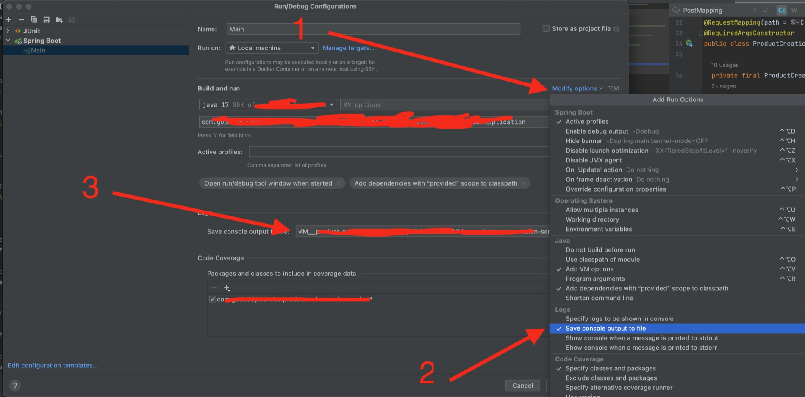
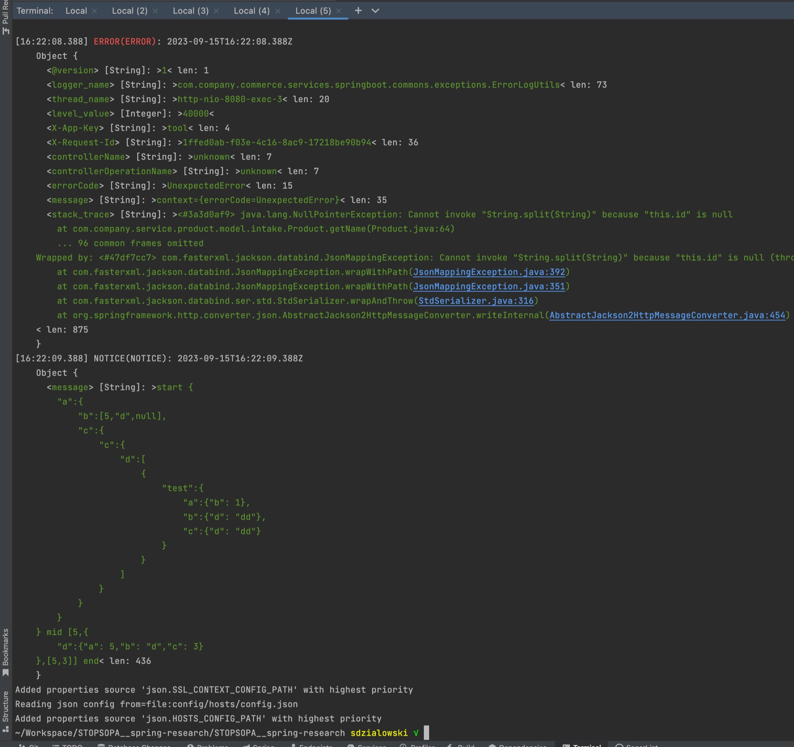

# github link
[https://github.com/stopsopa/log-wizzard](https://github.com/stopsopa/log-wizzard)


[https://stopsopa.github.io/log-wizzard/](https://stopsopa.github.io/log-wizzard/)


# Why? & What?

It's the simple spring boot log formatter.

I've tried to use pino-pretty library but there was a problem with clearning java stack in the log to make it more readable so I just made this library - Little weekend project.

It was created in one evening and later tweaked here and there. It's just simple utility tool for job at hand so please forgive me if you find its code ugly.


# The idea

The idea is to setup IDE (in this case IntelliJ) to stream server stdout of the springboot (also) to file. (for our example .git/debug.log)

and then in the IDE terminal use simple command ...

```

tail -f -n 1000 .git/debug | log-wizzard


```

... to format it and see it updating live



For the purpose of example above in the image here describing the process of configurying IntelliJ in point 3 just setup absolute path to location .git/debug.log in your project.

## for system user

```

wget --help 1> /dev/null 2> /dev/null
if [ "$?" = "0" ]; then
    sudo wget --no-cache -O "/usr/local/bin/log-wizzard" "https://stopsopa.github.io/log-wizzard/index.js"
else # curl
    sudo curl "https://stopsopa.github.io/log-wizzard/index.js" -o "/usr/local/bin/log-wizzard"
fi
if [ "$(printf "sha384-$(sudo cat "/usr/local/bin/log-wizzard" | openssl dgst -sha384 -binary | base64)")" = "sha384.sh::index.js" ]; then
  echo "checksum verified"
  sudo chmod +x /usr/local/bin/log-wizzard
  log-wizzard --help
else
  echo "checksum corrupted - deleting file"
  sudo rm "/usr/local/bin/log-wizzard"
fi

```

## per project

```

wget --help 1> /dev/null 2> /dev/null
if [ "$?" = "0" ]; then
    wget --no-cache -O ".git/log-wizzard.cjs" "https://stopsopa.github.io/log-wizzard/index.js"
else # curl
    curl "https://stopsopa.github.io/log-wizzard/index.js" -o ".git/log-wizzard.cjs"
fi
if [ "$(printf "sha384-$(sudo cat ".git/log-wizzard.cjs" | openssl dgst -sha384 -binary | base64)")" = "sha384.sh::index.js" ]; then
  echo "checksum verified"
  node ".git/log-wizzard.cjs" --help
else
  echo "checksum corrupted - deleting file"
  rm ".git/log-wizzard.cjs"
fi

```


# xx script block

```

      [`log-wizzard`]: {
        command: `
# HOW TO CONFIG: https://i.imgur.com/Hv9Dk7T.png
# USE PATH: /Users/xxxx/Workspace/xxxx/.git/debug.log
DEBUG=".git/debug.log"

log-wizzard --help 2> /dev/null > /dev/null
if [ "\${?}" != "0" ]; then
  cat <<EEE
  
    log-wizzard not installed, follow: https://stopsopa.github.io/log-wizzard/
    
EEE
  exit 1  
fi

tail -n 4000 -f "\${DEBUG}" | log-wizzard --formatter .git/formatter.cjs
`,
        confirm: false,
      },


```


# example

```

cat <<EEE | log-wizzard 
  .   ____          _            __ _ _
 /\\\\ / ___'_ __ _ _(_)_ __  __ _ \ \ \ \ 
( ( )\___ | '_ | '_| | '_ \/ _' | \ \ \ \ 
 \\\\/  ___)| |_)| | | | | || (_| |  ) ) ) ) 
  '  |____| .__|_| |_|_| |_\__, | / / / /
 =========|_|==============|___/=/_/_/_/
 :: Spring Boot ::                (v2.6.2)

{"timestamp":"2023-09-15T16:22:08.388Z","@version":"1","message":"context={errorCode=UnexpectedError}","logger_name":"com.company.commerce.services.springboot.commons.exceptions.ErrorLogUtils","thread_name":"http-nio-8080-exec-3","level":"ERROR","level_value":40000,"stack_trace":"<#3a3d0af9> java.lang.NullPointerException: Cannot invoke \"String.split(String)\" because \"this.id\" is null\n\tat com.company.service.product.model.intake.Product.getName(Product.java:64)\n\tat jdk.internal.reflect.NativeMethodAccessorImpl.invoke0(NativeMethodAccessorImpl.java)\n\tat jdk.internal.reflect.NativeMethodAccessorImpl.invoke(NativeMethodAccessorImpl.java:77)\n\tat jdk.internal.reflect.DelegatingMethodAccessorImpl.invoke(DelegatingMethodAccessorImpl.java:43)\n\tat java.lang.reflect.Method.invoke(Method.java:568)\n\tat com.fasterxml.jackson.databind.ser.BeanPropertyWriter.serializeAsField(BeanPropertyWriter.java:689)\n\tat com.fasterxml.jackson.databind.ser.std.BeanSerializerBase.serializeFields(BeanSerializerBase.java:774)\n\t... 96 common frames omitted\nWrapped by: <#47df7cc7> com.fasterxml.jackson.databind.JsonMappingException: Cannot invoke \"String.split(String)\" because \"this.id\" is null (through reference chain: com.company.service.product.model.intake.Product[\"name\"])\n\tat com.fasterxml.jackson.databind.JsonMappingException.wrapWithPath(JsonMappingException.java:392)\n\tat com.fasterxml.jackson.databind.JsonMappingException.wrapWithPath(JsonMappingException.java:351)\n\tat com.fasterxml.jackson.databind.ser.std.StdSerializer.wrapAndThrow(StdSerializer.java:316)\n\tat com.fasterxml.jackson.databind.ser.std.BeanSerializerBase.serializeFields(BeanSerializerBase.java:782)\n\tat com.fasterxml.jackson.databind.ser.BeanSerializer.serialize(BeanSerializer.java:178)\n\tat com.fasterxml.jackson.databind.ser.DefaultSerializerProvider._serialize(DefaultSerializerProvider.java:480)\n\tat com.fasterxml.jackson.databind.ser.DefaultSerializerProvider.serializeValue(DefaultSerializerProvider.java:319)\n\tat com.fasterxml.jackson.databind.ObjectWriter$Prefetch.serialize(ObjectWriter.java:1518)\n\tat com.fasterxml.jackson.databind.ObjectWriter.writeValue(ObjectWriter.java:1007)\n\tat org.springframework.http.converter.json.AbstractJackson2HttpMessageConverter.writeInternal(AbstractJackson2HttpMessageConverter.java:454)\n\t... 90 common frames omitted\nWrapped by: <#6ad29d49> org.springframework.http.converter.HttpMessageNotWritableException: Could not write JSON: Cannot invoke \"String.split(String)\" because \"this.id\" is null; nested exception is com.fasterxml.jackson.databind.JsonMappingException: Cannot invoke \"String.split(String)\" because \"this.id\" is null (through reference chain: com.company.service.product.model.intake.Product[\"name\"])\n\tat org.springframework.http.converter.json.AbstractJackson2HttpMessageConverter.writeInternal(AbstractJackson2HttpMessageConverter.java:463)\n\tat org.springframework.http.converter.AbstractGenericHttpMessageConverter.write(AbstractGenericHttpMessageConverter.java:104)\n\tat org.springframework.web.servlet.mvc.method.annotation.AbstractMessageConverterMethodProcessor.writeWithMessageConverters(AbstractMessageConverterMethodProcessor.java:290)\n\tat org.springframework.web.servlet.mvc.method.annotation.RequestResponseBodyMethodProcessor.handleReturnValue(RequestResponseBodyMethodProcessor.java:183)\n\tat org.springframework.web.method.support.HandlerMethodReturnValueHandlerComposite.handleReturnValue(HandlerMethodReturnValueHandlerComposite.java:78)\n\tat org.springframework.web.servlet.mvc.method.annotation.ServletInvocableHandlerMethod.invokeAndHandle(ServletInvocableHandlerMethod.java:135)\n\tat org.springframework.web.servlet.mvc.method.annotation.RequestMappingHandlerAdapter.invokeHandlerMethod(RequestMappingHandlerAdapter.java:895)\n\tat org.springframework.web.servlet.mvc.method.annotation.RequestMappingHandlerAdapter.handleInternal(RequestMappingHandlerAdapter.java:808)\n\tat org.springframework.web.servlet.mvc.method.AbstractHandlerMethodAdapter.handle(AbstractHandlerMethodAdapter.java:87)\n\tat org.springframework.web.servlet.DispatcherServlet.doDispatch(DispatcherServlet.java:1067)\n\t... 81 common frames omitted\nWrapped by: <#758a4f45> com.company.commerce.services.springboot.commons.exceptions.ServiceException: Fail to process the request. Details: Could not write JSON: Cannot invoke \"String.split(String)\" because \"this.id\" is null; nested exception is com.fasterxml.jackson.databind.JsonMappingException: Cannot invoke \"String.split(String)\" because \"this.id\" is null (through reference chain: com.company.service.product.model.intake.Product[\"name\"])\n\tat com.company.service.product.controller.GlobalExceptionHandler.unexpectedErrorExceptionHandler(GlobalExceptionHandler.java:74)\n\tat jdk.internal.reflect.NativeMethodAccessorImpl.invoke0(NativeMethodAccessorImpl.java)\n\tat jdk.internal.reflect.NativeMethodAccessorImpl.invoke(NativeMethodAccessorImpl.java:77)\n\tat jdk.internal.reflect.DelegatingMethodAccessorImpl.invoke(DelegatingMethodAccessorImpl.java:43)\n\tat java.lang.reflect.Method.invoke(Method.java:568)\n\tat org.springframework.web.method.support.InvocableHandlerMethod.doInvoke(InvocableHandlerMethod.java:205)\n\tat org.springframework.web.method.support.InvocableHandlerMethod.invokeForRequest(InvocableHandlerMethod.java:150)\n\tat org.springframework.web.servlet.mvc.method.annotation.ServletInvocableHandlerMethod.invokeAndHandle(ServletInvocableHandlerMethod.java:117)\n\tat org.springframework.web.servlet.mvc.method.annotation.ExceptionHandlerExceptionResolver.doResolveHandlerMethodException(ExceptionHandlerExceptionResolver.java:428)\n\tat org.springframework.web.servlet.handler.AbstractHandlerMethodExceptionResolver.doResolveException(AbstractHandlerMethodExceptionResolver.java:75)\n\tat org.springframework.web.servlet.handler.AbstractHandlerExceptionResolver.resolveException(AbstractHandlerExceptionResolver.java:142)\n\tat org.springframework.web.servlet.handler.HandlerExceptionResolverComposite.resolveException(HandlerExceptionResolverComposite.java:80)\n\tat org.springframework.web.servlet.DispatcherServlet.processHandlerException(DispatcherServlet.java:1327)\n\tat org.springframework.web.servlet.DispatcherServlet.processDispatchResult(DispatcherServlet.java:1138)\n\tat org.springframework.web.servlet.DispatcherServlet.doDispatch(DispatcherServlet.java:1084)\n\tat org.springframework.web.servlet.DispatcherServlet.doService(DispatcherServlet.java:963)\n\tat org.springframework.web.servlet.FrameworkServlet.processRequest(FrameworkServlet.java:1006)\n\tat org.springframework.web.servlet.FrameworkServlet.doPost(FrameworkServlet.java:909)\n\tat javax.servlet.http.HttpServlet.service(HttpServlet.java:681)\n\tat org.springframework.web.servlet.FrameworkServlet.service(FrameworkServlet.java:883)\n\tat javax.servlet.http.HttpServlet.service(HttpServlet.java:764)\n\tat org.apache.catalina.core.ApplicationFilterChain.internalDoFilter(ApplicationFilterChain.java:227)\n\tat org.apache.catalina.core.ApplicationFilterChain.doFilter(ApplicationFilterChain.java:162)\n\tat org.apache.tomcat.websocket.server.WsFilter.doFilter(WsFilter.java:53)\n\tat org.apache.catalina.core.ApplicationFilterChain.internalDoFilter(ApplicationFilterChain.java:189)\n\tat org.apache.catalina.core.ApplicationFilterChain.doFilter(ApplicationFilterChain.java:162)\n\tat org.springframework.security.web.FilterChainProxy$VirtualFilterChain.doFilter(FilterChainProxy.java:327)\n\tat org.springframework.security.web.access.intercept.FilterSecurityInterceptor.invoke(FilterSecurityInterceptor.java:115)\n\tat org.springframework.security.web.access.intercept.FilterSecurityInterceptor.doFilter(FilterSecurityInterceptor.java:81)\n\tat org.springframework.security.web.FilterChainProxy$VirtualFilterChain.doFilter(FilterChainProxy.java:336)\n\t... 66 frames truncated\n","X-App-Key":"tool","X-Request-Id":"1ffed0ab-f03e-4c16-8ac9-17218be90b94","controllerName":"unknown","controllerOperationName":"unknown","errorCode":"UnexpectedError"}
{"timestamp":"2023-09-15T16:22:09.388Z","message":"start {\"a\":{\"b\":[5,\"d\",null],\"c\":{\"c\":{\"d\":[{\"test\":{\"a\":{\"b\":1},\"b\":{\"d\":\"dd\"},\"c\":{\"d\":\"dd\"}}}]}}}} mid [5,{\"d\":{\"a\":5,\"b\":\"d\",\"c\":3}},[5,3]] end"}
Added properties source 'json.SSL_CONTEXT_CONFIG_PATH' with highest priority
Reading json config from=file:config/hosts/config.json
Added properties source 'json.HOSTS_CONFIG_PATH' with highest priority
EEE


```

will print



# The End

"Please show your support for this repository by starring it if you find it useful or enjoyable. Your stars help me gauge its value and prioritize maintenance efforts." - Corrected with ChatGPT 😆